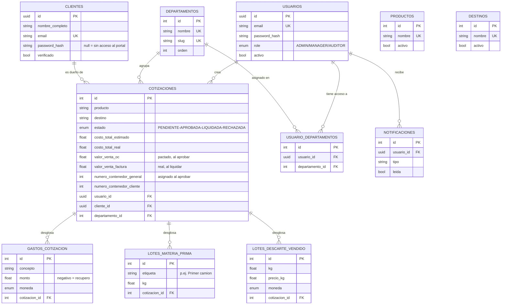

# Base de datos — diagrama actual

Fuente única de verdad: `backend/prisma/schema.prisma`. 10 tablas, PostgreSQL.

## Explicación rápida

- **`usuarios`**: cuentas internas del ERP (ADMIN/MANAGER/AUDITOR). `usuario_departamentos` define qué rubros administra cada uno (ADMIN/AUDITOR no necesitan fila, tienen acceso implícito a todo).
- **`clientes`**: portal externo. `password_hash` nullable — un cliente puede existir solo como registro de seguimiento (creado desde el cotizador) hasta que un ADMIN le "activa acceso".
- **`departamentos`**: los rubros del holding (Agroexportación, Importaciones, etc.) — hoy solo Agroexportación tiene funcionalidad real.
- **`productos` / `destinos`**: catálogo editable del cotizador (independiente de las categorías con las que el modelo ML fue entrenado).
- **`cotizaciones`**: la tabla central — es a la vez la cotización (estimado) y, una vez aprobada, el contenedor real. Vive en un pipeline de estados:
  `PENDIENTE` (editable, autoguardado) → `APROBADA` (se numera como contenedor, ya no editable) → `LIQUIDADA` (valores reales de cierre). `reabrir` puede devolverla un paso atrás.
  Guarda todo el ciclo de costos (materia prima, maquila, agenciamiento, SLI, recupero de descarte), la venta real vs. pactada, y la trazabilidad de logística (booking, fechas, contenedor de la naviera).
- **`gastos_cotizacion`**: gastos variables de cada operación (fletes, jabas, supervisión…), lista abierta por cotización.
- **`lotes_materia_prima`** / **`lotes_descarte_vendido`**: desgloses informativos (compra de fruta por camión; venta de descarte por kg×precio) — no cambian el costo, solo trazabilidad y verificación cruzada.
- **`notificaciones`**: se generan al crear/liquidar una cotización, propia por usuario.

**3 enums**: `rol_erp` (ADMIN/MANAGER/AUDITOR), `estado_cot` (PENDIENTE/APROBADA/EN_TRANSITO/LIQUIDADA/RECHAZADA), `moneda` (PEN/USD).
